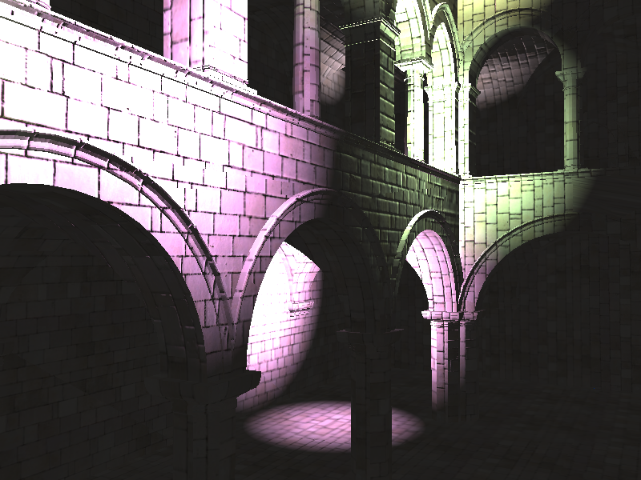

WebGL Deferred Shading
======================

**University of Pennsylvania, CIS 565: GPU Programming and Architecture, Project 6**

* Sanchit Garg
* Tested on: Safari Version 9.0.1 on
  Mac OSX 10.10.4, i7 @ 2.4 GHz, GT 650M 1GB (Personal Computer)

### Live Online

### Demo Video

### Deferred Shader

Implemented the scissor test, toon shader, sphere proxy in WebGL.

#### Debug Views

Depth view

Points view

Color Map view

Normal Map view

Geometry Normals view

Surface Normals view

#### Performance Analysis

I used the default scissor test. It gives a speed up of arounf 2x.

Looking at the impact of number of lights, we see that as we increse the number of lights, the FPS drops. A comparison of the FPS between with scissor test and without can be seen below.

